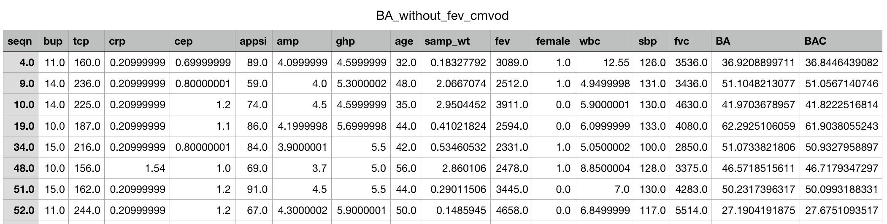

# Biological Age Project for Python README

**Author:** Elisa Warner  
**Date of Last Update:** Dec 23, 2019  
**Contact: elisawa@umich.edu**  
_Author's Note:_ The Python Notebook version `BA_NB_Final_V2.ipynb` is the most up-to-date. There is an older version of the python code called `Biological_Age_Application.py`. This is the next target for update.

## Description
This project is based off the paper "Modeling the Rate of Senescence: Can Estimated Biological Age Predict Mortality More Accurately Than Chronological Age?" by Morgan Levine (https://www.ncbi.nlm.nih.gov/pmc/articles/PMC3660119/), which is based on the Klemera-Doubal Method for calculating biological age (https://www.ncbi.nlm.nih.gov/pubmed/16318865). It features my original SAS implementation of the project, then a cleaner python script. The original paper was written to stratify males and females, but it is recognized here that this may not be the case for all implementations. Therefore, a "One Group" version is available, which includes no stratification.

## Background
In the original study, Levine applies the NHANES III dataset to the Klemera-Doubal Method. She first calculates a biological age of an individual based on the following equation:

where $q$ represents the intercept, $k$ represents the slope, and $s$ represents the MSE of every feature column $j$ regressed against age.  

She then calculates the Corrected Biological Age of the same individual based on the following equation:

where $CA$ represents the chronological age (true age) of the individual, and $s^2$ represents an age- and r-value-corrected MSE.

## Files Included:
1. BA_NB_Final_V2.ipynb : Python Notebook version
2. StudyReplicationReversedF.sas : Old SAS version
3. Biological_Age_Application.py : Old Python Script version
4. BioAgeSample_NHANESIII_without_fvc.txt : NHANES III sample dataset give to me by the author.

## Requirements
1. To run BA_NB_Final_V2 : Python 3.6+ with Anaconda
2. To run Biological_Age_Application.py : Python 2.7 with Anaconda
3. StudyReplicationReversedF.sas : SAS 9.0+

## IMPORTANT NOTES: 
1. Note that the cache is intended to save the calculated parameters. Therefore, if you change your dataset and need to update parameters, you must DELETE the cache file(s).  
2. For best use of biological age in general, it is important to run correlations on your dataset features to include only those features which are significantly correlated with age.

## How to Use:
### Dataset Setup (INPUT)
The original paper utilizes sample weights and stratifies by sex of the individual. Therefore, the dataset INPUT requires four special data columns:  
1. `seqn` : the unique primary key of each observation in the dataset  
2. `group` : this can be the sex of the subject (binary 0 or 1) or all '1's if you don't want stratification  
3. `samp_wt` : these are the sample weights for each individual (range: [0 1]). If you don't want to include sample weights, set this column with all '1's.  
4. `age` : This column is required for this study.  

To use this code, the program requires a delimited text file (either .csv, .tsv, or .txt). The current version requires datasets to be in list form rather than DataFrame. "List form" means that the data must be arranged as a list of lists, where the first row of the list of lists is the list of column names. If you start with a dataframe, this can be easily created by using Pandas command `to_list()`:  

**Convert DataFrame to list form**  

    # change format of train set to old format that BA method requires
    header_names = list(trainset)
    trainset_list = trainset.values.tolist()
    trainset_list.insert(0, header_names)

### Example Code 1
In the most simple example, our dataset is set up according to **Dataset Setup** above. And we have one dataset (not split into training and testing). The variables `age_index`, `genderindex`, `primaryindex`, `samp_wt_index` are the python indices of the age, group, seqn, and sample_wt columns, respectively. 

**Cache**  
`cachename` is the name of a cache file. If no cache file exists yet, assign any name. The cache file will be created automatically. It saves all the calculated parameters so that training and testing can be possible (the biological ages of the test set are simply based off of the saved parameters from the training set's cache file). The `cachename` argument allows users to save multiple cache files for more efficient execution.

**Execution Code:**

    import BA_NB_Final_V2 as BA  # import notebook

    model = BA.Methods(dataset_list, cachename, age = age_index, genderindex = genderindex, primarykey = primaryindex, samp_wt = samp_wt_index)`
    results = model.KDM() # run model`

### Example Code 2
In this example, we create a function for the KDM model. The assumption is that we have a training set (`trainset`) and testing set (`testset`), and an assigned Cache File (doesn't have to exist yet) (`cachename`). The training set and testing set are both pandas DataFrames.

The output is simply a float array of all the corrected Biological Ages for each subject.

    def KDM_model(trainset, testset, cachename):
        # set up dataset columns
        trainset['seqn'] = range(1,trainset.shape[0]+1)
        trainset['group'] = 1
        trainset['samp_wt'] = 1

        testset['seqn'] = range(1,testset.shape[0]+1)
        testset['group'] = 1
        testset['samp_wt'] = 1
    
        testset = testset.drop(['GROUP', 'Days_alive', 'age_months'], axis = 1)
        trainset = trainset.drop(['GROUP', 'Days_alive', 'age_months'], axis = 1)
        #print(testset.shape, trainset.shape)
    
        # convert DataFrame to List Format
        header_names = list(trainset)
        trainset_list = trainset.values.tolist()
        trainset_list.insert(0, header_names)
    
        testset_list = testset.values.tolist()
        testset_list.insert(0, header_names)
    
        # find indices for age, group, primary index, sample weights
        age_index = header_names.index('age_days')
        genderindex = header_names.index('group')
        primaryindex = header_names.index('seqn')
        samp_wt_index = header_names.index('samp_wt')
    
        # Build model
        model = BA.Methods(trainset_list, cachename, age = age_index, genderindex = genderindex, primarykey = primaryindex, samp_wt = samp_wt_index)
        model.KDM() # train model
    
        # change format of test set from DataFrame to List Format
        header_names = list(testset)
        testset_list = testset.values.tolist()
        testset_list.insert(0, header_names)
    
        # test using trained model
        test_model = BA.Methods(testset_list, cachename, age = age_index, genderindex = genderindex, primarykey = primaryindex, samp_wt = samp_wt_index)
        results = test_model.KDM()
        results = pd.DataFrame(results[1:], columns = results[0])
        # test_results = test_results.append(results) # this was designed for 5-fold cross validation, so it would append the results of each fold into one dataframe

        # calculate stats
        stats = return_stats(results['BAC'].astype('float64'), results['age_days'].astype('float64')) # output Biological Age, Corrected
    
    return (stats)

### Output Explained
An example output, saved to a csv file, will appear like so:

The complete dataset is still visible, but two columns appear at the end of the file: `BA` and `BAC`. `BA` is defined above in **Background** as the initial, uncorrected Biological Age. `BAC` is also defined above as the corrected Biological Age based both on `BA` and on the true chronological age of the individual.

### Hyperparameters
There are two hyperparameters in this code:  
1. `GRAPHON` : With `GRAPHON = True`, the simple linear regression plots for each feature regressed against age will show upon calculation of the linear regression (calculations only occur when the cache file does not exist). This option is turned off by default (`GRAPHON = False`) because the graphs require the `ggplot` package, which currently requires some tweaking to make work without error due to version upgrade issues.  
2. `AGEON` : This is a linear transformation of the SBA variable (_see paper_) that was conducted in the original paper  
            # Extra step: Linearly transform so that SBA maintains same mean but now linearly increases with age, so difference is 5 between CAmax and CAmin
In my experience, this transformation does little to change the overall results. It is set by default to true (`AGEON = True`)  

These hyperparameters are hard to find in the notebook code. However, to change them, find the following lines, and change the values as needed. Note that if `GRAPHON = True`, `import ggplot as gg` also needs to be uncommented:

        self.AGEON = True # age corrector toggle
        self.GRAPHON = False # do you want to see linear regression graphs for each variable on age?
